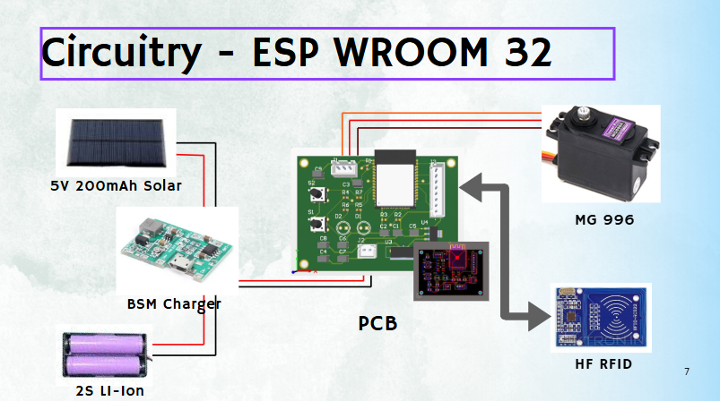

---

# ⚡ **PCB and Circuitry**

<p align="center">
  
</p>

---

## 🎯 **Project Overview**

This repository documents all **PCB designs, schematics, and circuit implementations** developed as part of the **Velocity 2025** initiative.
The goal is to **design, simulate, and fabricate** reliable and optimized electronic circuits for various applications, ensuring **high performance**, **low noise**, and **cost efficiency**.

---

## ✨ **Features**

✅ **Professional PCB Layouts** – Designed using industry-standard tools

✅ **Optimized Routing** – Ensures minimal noise and interference

✅ **Schematics and Documentation** – Clear and detailed circuit explanations

✅ **Manufacturing-Ready Files** – Includes Gerber, drill, and fabrication outputs

✅ **Open for Collaboration** – Contributions are welcome!

---

## 🛠 **Technologies & Tools Used**

| 🖥 **Design Software**  | 🔌 **Components**          | 🔬 **Testing & Simulation** |
| ----------------------- | -------------------------- | --------------------------- |
|      Altium Designer    | Resistors, Capacitors, ICs | LTSpice, Multisim           |


---

## 📂 **Repository Structure**

```
PCB_and_Circuitry/
│
├── Schematics/           # All circuit diagrams and schematic files
├── PCB_Layouts/          # PCB design files 
├── Gerber_Files/         # Fabrication-ready Gerber and drill files
├── Microcomtroller code/ # ino file for arduino code
└── Docs/                 # Reference documents and design notes
```

---

## 🚀 **Getting Started**

1. **Clone this repository**

   ```bash
   git clone https://github.com/Velocity-2025/PCB_and_Circuitry.git
   cd PCB_and_Circuitry
   ```

2. **Open the project** in **Altium**.

3. **Export Gerber files** and send them to a PCB manufacturer.

---

## 📸 **Preview**


<p align="center">
  
</p>

---


## 📜 **License**

This project is licensed under the **MIT License** – see the [LICENSE](LICENSE) file for details.

---


